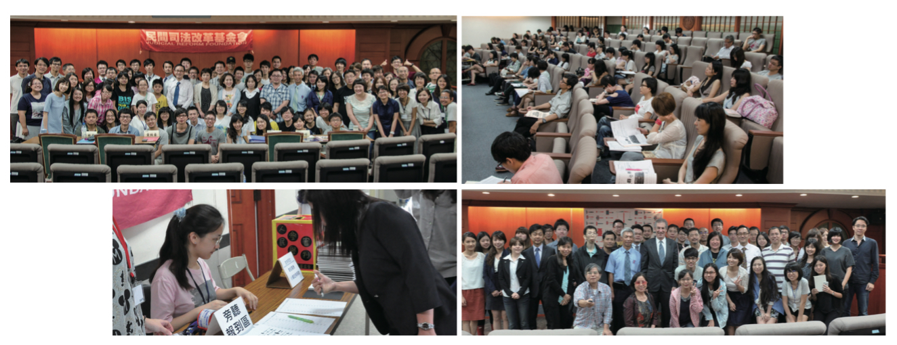

# 前言：老實模擬 誠懇負責 推動政策

**高榮志 民間司法改革基金會執行長**

這本以「陪審制」為基調的模擬法庭專刊，不是要「展現成果」。相反的，它是我們操作四場模擬法庭之後，定下心來的自我反思。

四場活動下來，我們對於陪審團制度的操作，有了更深一層的認識，同時，更理解要推動「真正的」人民參與審判制度，絕對不是一蹴可幾。這是一個制度性的變革，牽扯的面向繁多。需要充份的溝通，詳細的比較，老實的模擬，誠懇地提出配套，如此，才算是負責的推動政策。

這當然就是在批評司法院。初期幾乎是急就章地決定政策，抗拒配套，打算隨意模擬幾場後，就要立法上路。不太在意外國制度的比較研究，不太願意與外界溝通，獨創出舉世所無的「觀審制」。觀審制的弊病，不少評論員的文章，都已經具體指出。

反之，許多文章不約而同指出，陪審制的最大特色，就是讓法官退居調查證據與認定事實的第二線，因此，法官就會顯得非常公正，更加符合我們對「公平法院」的期待。所有在模擬法庭裡擔任法官的人，幾乎都提到了這一點。同時，檢察官和律師的角色，在現場瞬息萬變的交互詰問法庭裡，也會獲得強化。檢察官必須做好舉證責任的工作，才能說服陪審員，律師也必須做好準備，否則就會一路挨打。

有趣的是，素人陪審員比較謙虛，文章裡面常常透露出自己還沒有準備好的訊息。然而，四場模擬法庭下來，法律的專業人士，卻是對「素人法官」有著越來越高的評價和肯定。或許，這正是引進人民參與審判制度，首先所應該破除的最大迷思：「不懂法律的人，怎麼能當法官？」

這個問題，問反了，也問錯了。人民參與審判制度，正是要讓「不懂法律的人」來當法官，甚至，法律還會明文排除懂法律的專業人士。這正是制度特色，背後當然有一套它所預設的道理。林林總總的緣由，大抵就是恰好可以解決職業法官的可能缺點。

於是，人民只要帶著自己的生活經驗，像一張白紙一樣，坐進法庭裡，就具備了「當法官」的能力。其它的部分，都是制度上所需要補足的。不管是如何讓素人在短時間內，能理解法律的基本原則，能公平地聆聽審判，詳細的思辨討論，一直到操作法律要件，作出具體的判斷，這一切的一切，都是「制度」應該設計好的「措施」。素人法官運作不順，是制度設計不良，並不能用「不懂法律」來攻擊陪審員。

也因此，我們不揣簡陋，收錄了慢慢累積下來的「KNOW-HOW」，希望和大家分享這些基礎，也算是台灣模擬陪審團審判的「在地經驗」。同時，我們更擴大舉辦了第四場的活動，並且在立法院與司法院的共同協助之下，克服了經費與人力都捉襟見肘的困難，邀請了具有陪審團豐富經驗的美國ISCOE法官，來台展開一系列的演講與工作坊。

ISCOE 法官不但全程參與了第四場陪審團模擬審判的活動，提供了寶貴的經驗分享，還大方地留下了幾場演講的大綱，以及親筆所撰寫的相關刑事訴訟規則，他希望能帶給台灣的熱情朋友們，更多了解陪審團制度的幫助。

我們知道，僅僅四場的模擬法庭，是遠遠不夠的，除了不斷提出檢討與反思之外，也承諾將會繼續模擬下去。同時，我們也知道，現行的民間版法案，在沒有整體配套刑事訴訟法的修正之前，仍是非常簡陋。我們定會一步一腳印地往前續行。

最後要說的是，觀察陪審員在討論評議的過程，一開始，總覺得他們試圖操作法律術語進行討論，實在非常不精準。然而，幾場聽下來，如果法律專業者能暫時放下心中的專業傲慢，或許會慢慢發現，不精準術語的背後，其實是毫不遜色的法感與多元視角。也會慢慢理解，有罪推定是每個人的天性，無罪推定的落實，靠一群人所建立的制度，比單靠一個人的法官，來的更加堅實可靠。

老實的說，我們需要更多的模擬法庭，以累積更豐富的經驗。更多更精緻的操作、改進與對話，才是誠懇、負責來推動政策的方法。

