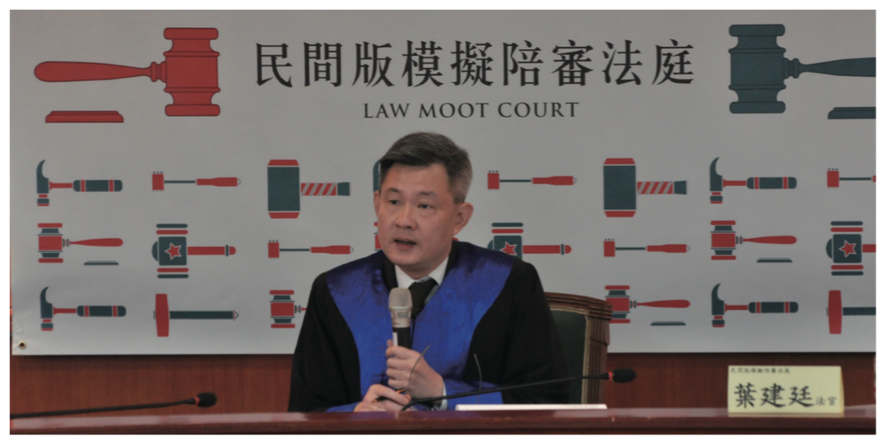

# 審判長 陪審制下的法官真的在聽訟！不是「聽爽」

**葉建廷 律師、民間司改會諮詢委員**

我已經不記得是什麼原因會來擔任司改會第三場模擬法庭法官的角色了，不是羅秉成律師陷害，就是尤伯祥律師，反正我們彼此也經常互相「陷害」。

曾經在檢察官不全程到庭實行公訴的時空背景下擔任過刑庭法官（1996-2001），接下來台北地院試辦檢察官全程到庭，2003 年 9 月全國開始施行所謂改良式當事人進行主義的刑事訴訟制度，在仍然是卷證併送制度下實施改良式當事人進行主義，老實說，坐在法官那個位置上，「聽爽」的感覺多，檢辯雙方在做什麼，多數的法官都了然於胸，判決書最後是法官要寫，寫判決時要什麼素材，缺什麼材料，法官肯定比檢辯雙方還要清楚。

司改會舉辦的模擬法庭，不僅採取陪審制，還是採起訴狀一本主義，這對曾經擔任過法官的我來說都是陌生的。開庭前腦筋一片空白，手上只有2頁的起訴書，準備程序進行後檢辯雙方出證、初步決定證據能力的有無、整理爭點、排定審判期日雙方調查證據的順序，對於擔任過職業法官的我來說，駕輕就熟，這時的法官，因為沒有先前接觸卷證的影響，想不中立，都很難。到了選任陪審員程序，檢辯雙方竭盡所能去剔除不想要的陪審員，另一方面要去納入對自己有利的陪審員，這一場扮演檢察官、辯護人角色的律師們，實在太盡責了，連法官如果手癢，想要伸手進來，對不起，門都沒有，中立的角色，到這裡都還在。

等陪審員就位了，在陪審制下擔任法官第一個最大的挑戰來了。你必須利用非常有限的時間，將艱澀難懂的法律原則（像無罪推定、超越合理懷疑啦），用最白話，最淺顯的方式跟陪審員溝通，試著讓陪審員都瞭解。這有多難，你自己到路邊拉一個路人過來，試著跟他說一遍就知道。接著進行證人交互詰問，這時擔任法官的人，你會充分了解「全神貫注」這四個中文字的意義是什麼，沒有書記官把當庭問答內容打出來，你必須聽，認真聽，仔細聽，用力聽，檢辯雙方提出異議時，以前學過的證據法則必須馬上搬出來，有疑問時，請檢辯雙方上前，一同討論該駁回異議或准許異議，這都是卷證併送下沒有的全新體驗，法官要做的，就是讓陪審員可以客觀、中立認定事實而已。

等證人交互詰問完畢，旁聽的民眾在欣賞檢辯雙方精彩的論告及辯護，聽的都忘我時，別高興的太早，法官還得即時消化這精彩的論告及辯護，因為你要歸納、整理之後，再用一次更白話的方式給陪審員評議前指示，好讓他們在進行評議時，有適當的原則可以遵循。當然，評議前指示的內容，法官可別想要去偏袒任何一方，我記得，擔任辯護人角色的黃致豪律師請我在評議前指示加入一段文字，提醒陪審員針對某一項爭點如何妥適進行評議，當然檢方不會同意，最後雙方折衷用都可以接受的文字去告訴陪審員。更有陪審員提出對於被告精神狀況是否正常，到底應該由檢察官或辯護人負舉證責任的問題，檢辯雙方還進行 Bench Meeting，法官中立的角色，到現在，都在。

接著陪審員進入評議室評議，透過同步實況轉播，很驚訝的發現，陪審員素質之高，討論之熱烈，簡直超乎大家的想像。這時沒有法官在評議室內告訴陪審員說判例內容是什麼，雖然少了「法學權威」在一旁的關心，但你可以發現，人民認定、觀察事實的能力並不會偏離經驗法則。

你或許沒來旁聽這一場模擬法庭，沒關係，我很簡單的把這一場模擬法庭的過程，站在法官的立場寫了一遍，你發現什麼？法官客觀、中立的角色一直都維持著。其實這不就是長久以來人民對刑事訴訟制度改革最卑微的一個訴求嗎？在陪審制加起訴狀一本主義的制度下，法官擔任的就是類似網球裁判的角色，而不用再擔任跟著球員滿場跑的足球裁判，真的，「聽訟」就好！

既然要人民參與審判，就請給人民完全的權力！讓法官扮演中立的聽訟角色，不偏不倚的把訴訟程序指揮好，然後信賴人民的判斷，再簡單也不過。讓人民進入法庭參與審判，卻又規定人民說的，法官可以不採，這種人民參與審判，你認為真的妥當嗎？

