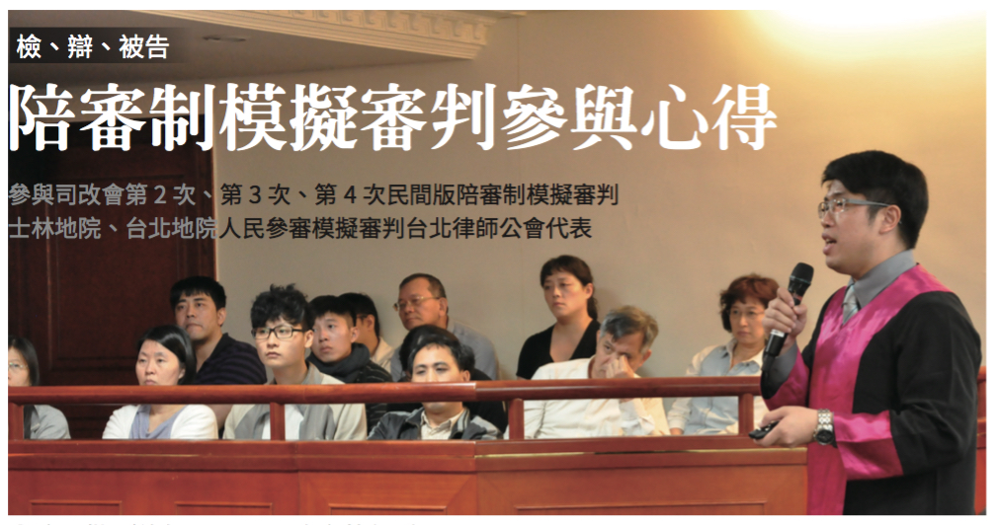

# 檢、辯、被告 陪審制模擬審判參與心得
#### 參與司改會第2次、第3次、第4次民間版陪審制模擬審判士林地院、台北地院人民參審模擬審判台北律師公會代表

**沈元楷 律師、民間司改會執行委員**

#### 前言

於 1220 年英國西敏區的一起謀殺案的刑事審判，一位名叫愛麗絲的女性被告自動供出有另外五名男子和她一起涉案，希望能藉此免除一死，由於當時的教宗已禁止水刑或火刑的方式進行神裁，又由於她是女子，也無法依據決鬥審判方式解決這個共犯供述不一致的爭議，法官開始傷腦筋。此時，這五位被愛麗絲指控的人表示，願意接受「十二名地主鄰居」的審判，「不論好壞」。法官把這些鄰居聚集起來，這些老百姓很快地發誓說，其中一名男子是好人，其他四名男子是賊子，這四名可憐的傢伙很快被吊死了，那名幸運的男子則當場獲釋，這就是陪審團制度的濫觴。

時至今日，陪審團制度隨著大英帝國的擴展，散步到世界各個殖民地的角落（據統計至今有超過四方之一的國家，都採用某種形式的陪審團制），其最基本的假設還是沒變：「在面臨我的自由和生命可能被一時或永久剝奪時，與其被一個全知全能的「大人」（無論是上帝還是法官）審判，寧願接受和我一樣的「普通人」（例如說鄰人）的審判」，這是司法民主化的概念。

臺灣受到儒家思想的影響很深，我們距離稱呼法官、檢察官以及執法人員「大人」的時間還不是太遠，希望大人們明察秋毫的渴望，迄今在各大院檢還是每天都聽得到，人們骨子裡似乎還是有「尋找包青天」的想法，似乎比較推崇司法上「權威」、「專業」。而我從小到大就是英美法庭劇的愛好者，成為訴訟律師或多或少也都有受到眾多實際或虛構的法庭英雄的影響，也一向好奇，在我所生長的這塊土地上，究竟有沒有可能存在有陪審制的空間與可能？在政黨數次輪替、公民意識覺醒、公民活動蓬勃發展的今天，政治民主已被證實可在臺灣實際運作（姑且不論它也有很多缺點），那麼，象徵司法民主化的陪審團制度呢？也因此，我參與了司改會的陪審制模擬審判法庭，套句製作人尤伯祥大律師「因為很重要，所以講三次」的口頭禪，因為這問題對我很重要，我也參與了三次（分別是第二次、第三次、第四次模擬法庭），其中也分別扮演了檢察官，甚至被告的角色。以下將以夾敘夾議的方式，略述經過和個人參與感想。

#### 第二次模擬審判：室友吵架割喉案—素人對證據的看法很有可能和專業法律人不同，我們一定是正確的嗎？

第二次模擬審判的案由，是一件室友吵架產生扭打，被告持刀劃到被害人脖子，造成一道長達七公分的表淺傷，檢方起訴殺人未遂，辯方的抗辯為過失傷害的案例。於此案我和鄭深元律師一同擔任公訴檢察官的角色，在本次模擬中，我體會到在陪審制以及無罪推定原則下，證明被告有罪可能是個比想像中艱鉅許多的考驗。身為檢方，案件理論理所當然是由凶器的尖銳程度、致死可能性，以及傷口的位置是位於致命的咽喉部位，去建構被告確實有殺人犯意，當然如此案件理論的弱點在於被告和被害人並無深仇大怨，且傷口較為表淺，因此我們用喉部解剖圖、甚至用女童割喉案、殺雞都是割喉嚨等較為通俗甚至煽情的方式去強化被告有殺意的論點，值得一提的是，鄭深元律師雖然轉任律師已有一段時間，公訴功力不僅寶刀未老，攻擊力道甚至高過很多公訴檢察官。可惜我們並沒有成功，陪審團主要還是依據是表淺傷認定沒有殺人犯意。由此可以得到的感想是，陪審團未必像某些論者所主張全然理盲、濫情，可以純粹用單純訴諸法感情或社會輿論的方式加以煽動、操縱，這或許可以吸引到陪審團的注意力，但是最終在評議時決定勝負的並不是此點，還是在於證據的鋪陳能否說服陪審團，由於舉證責任在檢方，且素人對於證據的看法，例如要相信哪一位證人、物證書證的解讀和法律人不盡相同，再加上辯方不斷強調無罪推定原則，因此要證明有罪比想像中困難。

本件最讓我印象深刻的是，由於有幾位陪審員的證據認定和檢方相差較遠，故事後向製作人尤伯祥律師表達了如果依照素人的經驗法則判斷證據是否會誤判的疑慮。尤律師和我說了一句話，素人的證據法則和專業法律人一定會有不同，問題是我們憑什麼認為我們比較對？這句話讓我反思不已。確實，隨著辦案經驗的累積，專業法律人對於爭點的釐清、關鍵證據的解讀會日漸熟稔，並逐步將案件分類，形成一套專業法律人的經驗法則和論理法則，藉以有效率地處理案件，並確保在多數情形下不致於出錯。不過，每個案件的情況不同，這樣的經驗法則或有可能會形成先入為主的偏見。相形之下，素人陪審員很可能一輩子只有一次審理案件的機會，除了態度更為謹慎外，也會依據自己的生活經驗，從許多專業法律人沒有想過的角度去解讀證據，點出審檢辯都沒有注意的盲點，誠然，其正確性未必一定會高於法律專家，但是至少有機會探討各種不同的可能性，降低因獨斷獨行而產生誤判的機率。

#### 第三次模擬審判：憂鬱男子家暴殺妻案—法庭溝通的白話化、口語化

第三次模擬審判的案由，是一位自稱有重度憂鬱症的男子，於和前妻爭輸女兒監護權後，持著水果刀將前妻砍到肚破腸流，並潑灑硫酸的家暴殺人未遂案例（本案也是我曾經擔任辯護人的士林地院第九次人民參審模擬審判的模擬案例）。

本件的亮點有二，第一，參與人員方面，被告是由楊儒門先生擔任，楊兄粗豪外表下帶有一絲憂鬱和柔情的氣息，實為本案男一的不二人選。公訴檢察官方面則是由羅秉成大律師和孫正華大律師擔任。有趣的是，數十年來只有看過羅律師和穿紫袍的檢察官對打，從來沒有看過他穿上紫袍，強勢威猛的反詰問和論告，更充分顯現「羅檢」換了位置就換了腦袋的彈性和實力（羅律師本身的感言是，覺得很爽，充分顯現在霸凌證人後所展現的霸氣）。第二，專家證人的引進，本件重要爭點在於被告於行為當時是否有精神耗弱甚至精神喪失的情形，理應是透過精神鑑定專家的引入來判斷，士林地院受限於時間不夠和缺乏人選無法如此實行，有些美中不足。但司改會透過黃致豪大律師（亦為本件模擬審判辯護人，現就讀於台大心理所博士班），找到了心理學博士資格的黃醫師出具鑑定報告書，並出庭擔任專家證人，讓本件於模擬上的意義和充實度增加許多。

於本件我是擔任「羅檢」和「孫檢」的助理檢察官，原本只是幫忙寫寫狀、訪談證人，但卻因故臨時上場主詰專家證人，對我而言是一個新鮮的體驗，也充分體會陪審制下，詰問專家證人技術的不同。在目前的審制下，由於專家證人在出庭前通常已出具鑑定報告，且審檢辯於開庭前均已將之詳閱，因此大抵是圍繞鑑定報告而展開的，為了節省時間，也常有審檢辯照著鑑定報告逐字唸，詢問有無意見補充的情形。不過，在陪審制下，由於事實判斷者是素人，因此檢辯雙方於主詰問時必須透過詰問技術引導專家證人用更為白話、更為口語的方式講解事實上相當專業的理論，並讓一般人能夠聽懂。於反詰問上，則必須透過詰問去指出專家證人犯了一般人從常識上就看的出來的錯，就好像丹佐華盛頓在電影費城中的口頭禪「請把我當六歲小孩，解釋給我聽，為什麼？」，這說起來容易，事實上律師必須對該專業有充分的理解，也須具有高段的詰問技術，事實上很不容易做到。由此，也可看出陪審制的特點之一，就是法庭溝通的口語化、白話化，律師為了能夠讓一般非法律人能夠理解事實和法律上的論點，必須將深奧的專業意見和法律見解翻譯成白話文，透過這樣翻譯、理解的過程，應該有助於拉近社會與專業審判的距離，增加人民對司法的信任。

#### 第四次模擬審判：跨國運毒案—擔任被告的初體驗

第四次模擬審判的案由是一位住在帝寶的小開，在泰國曼谷將海洛因交付給女性友人，讓其運送回臺灣，之後該女性友人被查獲，小開遭到調查局調查官誘捕偵查後被查獲起訴之跨國運毒案件。

本次案件的亮點為：第一，為了因應美國聯邦上訴法院（華盛頓哥倫比亞特區）法官 Craig Iscoe 的來訪指導，本件無論在案情複雜度、被告人數、證人人數、辯護人人數、證據的精緻程度，都是歷次之最。第二，參與者方面，檢方是由曾擔任檢察官經驗的鄭深元律師和鄭嘉欣律師擔任，第一辯方（小開的辯護人）則是由製作人尤伯祥大律師親自下海擔當，和本小組台柱林俊宏律師組成堅強的辯護陣容。第三，本件的調查官、男性被告帝寶小開、女性被告運毒者，均是由現職律師擔任，且為了測試陪審員對於男性被告前後供述不一的判斷能力，還特地拍攝製作了過程平和的警詢錄音錄影紀錄。

本件雖然案情最為複雜，但我的心情卻最為輕鬆，因為我參與的身分不是檢辯雙方，而是被告，我既不需要慷慨激昂地在陪審團面前論告或辯護，也不需要和證人在詰問上鬥智鬥力，只要作好我自己就好，再加上我是個法庭戲迷，自然希望能扮演類似電影沉默的羔羊中的吃人醫師漢尼拔（安東尼奧霍普金斯飾），或是電影驚悚中的雙面殺人犯艾倫（愛德華諾頓飾）等深沉、多智又狡猾的被告。結果呢？當然完全不是那麼一回事，在我的首席辯護人尤伯祥律師的巧手設計下，我成了一位和上開經典角色迥異，「可愛又迷人的反派角色」，我印象最深刻的是，尤律師雖然確實有為被告本人利益提出刑求抗辯，但理由卻是「被告臉部浮腫，顯然被調查人員刑求毆打過」，而擔任檢方的鄭深元律師則妙答以「被告原本就是生得臉部肥腫，顯然和調查人員無關」，擔任審判長的蔡志宏法官還特別點我起來看了兩眼說「我看被告本來就是長這樣，抗辯駁回」冷面笑匠的作風讓全場開懷大笑（當然還有我碎了一地的玻璃心）。

不過，此一難得的經驗，雖然有趣，但也讓我更深刻地體認到被告的處境。身為辯護律師，我們常會扮演導演或教練的角色，幫當事人庭前作相關的模擬問答，但是當事人最後在法庭上呈現出來的成果，通常會與庭前有相當的落差，其落差之大，有時甚至會讓辯護人有不怕神一般的對手，就怕有某種動物般的隊友的怨嘆（猶記得本次模擬法庭首席辯護人尤律師在我走下證人台後冷笑著和我說，連否認都否認得這麼不乾不脆，去關一關算了，大概就是這種感覺吧）。不過，依我於本次模擬法庭的經驗，實際坐上證人台並朗讀結文宣誓後，確實是會感受到不同以往的壓力，即使是接受我方辯護人的主詰問，有時候腦中都會一片空白，更遑論是接受檢察官或法官反詰問或職權訊問，如果詰問者經驗豐富，問題犀利，對於被告更會是非常艱鉅的考驗。本件負責反詰問我的，是甫從檢察官崗位轉任律師的鄭嘉欣大律師，正是刁鑽犀利，經驗老道的詰問高手，即使是自認平時臨場反應和表達能力不差的我，都覺得有些問題難以招架，更何況是沒有正常情形下鮮少有法庭經驗的被告？由此我有幾點感想：第一，有時候不要怪當事人在法庭上出包，因為那是沒有法庭經驗的正常人，在面對重重壓力底下的正常反應，身為律師，要幫助當事人作更充足的準備。第二，辯護依賴權的重要，如同前述，陪審制法庭的攻防十分專業和凶險，被告一定需要辯護律師專業且強而有力的辯護，才能有效保障自己的權益。最後值得一提的是，本件由製作人尤律師親自下場擔任首席辯護人的結果是，陪審團無法達成一致決而解散陪審團，被告（也就是筆者）也因此保有自由之身，Iscoe 法官基於多年豐富美國審判實務經驗表示「Congratulations, but you look guilty to me（恭喜，但我覺得你是有罪的）」，充分顯示「千金難買好律師」優秀的辯護人是如何讓案件起死回生，對被告的辯護權有多麼重要。

#### 小結

在經歷過多次陪審制的模擬審判，特別是有擔任過被告的經驗後，再重新去省思陪審制的起源，我越來越了解為何在八百多年前，被愛麗絲控訴的那五個西敏區的英國男子為何希望願意接受「十二名地主鄰居」的審判，「不論好壞」，大概是因為與其被一個全知全能的「大人」審判，寧願接受和我一樣的「普通人」的審判，至少在和我比較相近的生活經驗下，他們看待證據的看法不會和我脫節得太遠，在多數人都是第一次共同審判，共同決定有罪與否的基礎上，理論上比較能夠制衡因為偏見、獨斷或是怠惰而產生的誤判。現今有關於是否採取陪審制的論述，似乎都有點簡單，贊成者認為採取陪審制能夠除去恐龍法官、讓人民重新信賴司法，反對者認為人民理盲、濫情，採取陪審制只會造成更大的災難，其實，依筆者個人之見，恐龍的未必只有法官，理盲、濫情的又何止人民，唯有透過好的制度設計，讓法律人、非法律人在審判程序中共同參與、溝通、討論，才能真正避免上述恐龍、理盲、濫情的情形，也才能真正重建人民對司法的信賴，最後謹以《審判的歷史》一書中的一段話，作一個註腳：「陪審員不是聖人，也不是永無過失、全知的人，但是陪審員的多樣化，至少有機會去緩和彼此的缺點，這是懷有類似心靈的專業人士的偏見甚或是愚蠢不太可能達到的，更遑論是獨自審判的法官。」這也是筆者認為陪審制或是人民參與的模擬審判，值得繼續努力做下去的理由。
