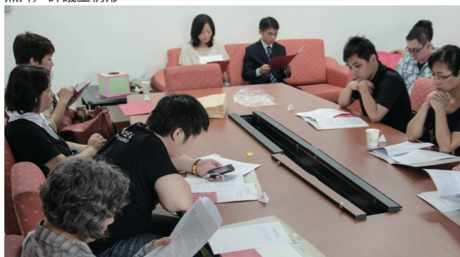
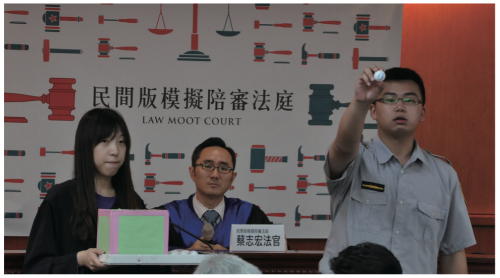

# 陪審員 擔任模擬法庭陪審員的收穫與學習

**樓元玨 家管**

滅「頂」事件沸沸揚揚時，許多人覺得群眾的撻伐與顯而易見的黑心事實，必能讓
廠商被判極刑，進而彰顯社會該有的正義與公道。但隨著司法程序的進行，透過媒體的
報導，大家卻發現這些黑心廠商似乎都被所謂的「恐龍法官」或「雲端法官」輕判，法
律好像真的不能成為懲奸除惡的利器，反而落得「只保護懂法律的人」的慨歎。

這是我在參加民間司改會徵選人民參與審判模擬陪審法庭陪審員之前，經常會有的疑
惑。雖然知道專業的法學訓練不可能讓這麼多案件的承審法官都是大眾眼中恐龍級、雲
端級法官，但也不免在媒體出現類似報導時，人云亦云的跟著談論與抱怨。

但是，有幸受邀擔任模擬法庭陪審員，透過閱讀審前指示與實際模擬後，終於了解
外國影集中，為何罪犯可以在證據無法證明有罪時，得意洋洋的逍遙法外。原來無罪推
定是所有法官心中最基本的原則；而所謂的證據，則須達到無可懷疑的程度，才具有證
據力。因此，法官不能因為群情激憤就預設被告有罪，更不會僅憑被告的自白就做出有
罪的判決。

我很高興有機會透過參與模擬法庭的方式，讓自己了解更多法律審判的過程以及法官在審判時所依據的重要原則。讓我了解法治社會其實也是一種權衡與選擇。當我們期待司法能公平地依法論刑時，就必須承受法律未能與時俱進所造成的不食人間煙火。或者是在同時重視程序正義與結果正義的台灣，我們經常得面對想兩全實際卻搖擺其中的尷尬。這是大家該有的共識，而非相互指責的根源。

所以，如果能將徵選「人民參與審判模擬陪審法庭」陪審員，作為一種推廣的手段，讓政府與民間團體攜手，藉此提升公民的法律素養。即使短時間內，台灣還無法推展人民參與審判或是陪審員制度，但在大家有能力且願意依法論法後，媒體也就沒有機會透過簡化的內容煽情鼓動一般民眾理盲的情緒，進而塑造一種民粹審判的氛圍。

台灣需要更多對話與理解，正如我們在陪審團運作過程中，來自不同階層與背景的陪審員，必須相互論述自己的意見，並聆聽他人的看法，透過說服與退讓的折衝，達成一致共識，才能進一步向法官表述，否則就只能面對解散的命運。如果，我們都期待公平正義，接下來就是將彼此對於何謂公平正義的觀點相互揭露，而法律則是不同內涵的公平與正義間的最大公因數。

相信法律，但不迷信法律是伸張個人的公平正義，我們才能在情緒性滅「頂」的同時，不會衝動的期待承審法官處以極刑，將所有不合預期的結果都視為「恐龍法官」或「雲端法官」的恣意妄為。
