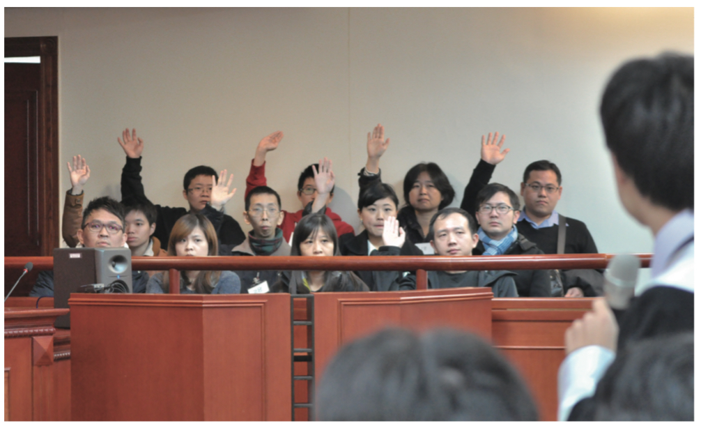

# 陪審員 誰有資格化身正義？

**劫機/工程師**

我是個工程師。對臺灣司法界──尤其是法官判案──的想像，主要為很偏狹的兩種：「伸張正義」或「恐龍判決」。

於是一個不巧看太多法庭影集、又恰好有追蹤司改會粉絲專頁的工程師，看到電視上演的「陪審團」竟然即將在臺灣舉辦「民間模擬版」，自然興奮不已的報名。歷經事前的陪審員遴選，我有幸成了陪審團的 12 人之一。

「民間版模擬陪審法庭」當天，檢察官/律師交鋒，交叉詰問證人及當事人，法官的指導及判斷，身為觀察一切的陪審員，發覺判案真的難。

身為工程師，很習慣追求「正確」答案。然而這一天下來的體驗發現，對我來說，法律沒有辦法很明確的切出一條線、沒有所謂黑白分明的兩邊。法律比較像光譜，真正的「黑」、「白」在很極端的狀態下才會出現，大部分的情況，必須在各種灰色中找尋自己的黑白。

還記得陪審員遴選時被提問，「針對『領域上的專家』提供的見解與資訊，請問你能不能基於『自己』的理解做出判斷？」我舉手，我認為自己可以。但是我的判斷不等於別人的判斷。在陪審團進入小房間討論前，我成了被籤抽中的三名沈默陪審員之一，轉換為「近距離觀察」九位正式陪審員討論案情的旁觀者。滿腔主觀意見卻不能發言，於是趁著難得的「強迫傾聽者」身份，和其他人對照自己的想法。

聆聽、溝通、互相理解，因為曾經經歷的不同生命軌跡，我們對黑白的界定有很大的差異，也許我認為這個證據能支持檢方說法，但別人卻覺得那恰恰證明了被告無罪。

本次陪審依主辦規定，採「三分之二」就可算共識的多數決，所以沒有像影集裡演的兩方意見僵持、懸宕多時。針對檢方與被告間的爭點，陪審員們的意見由發散到收斂，又可能因為一個人的發言指出盲點，全員轉向另外一方。

而來回震盪多次後，最後陪審團的討論回到一個關鍵：舉證責任在誰？如果我們都覺得難以畫分到黑、白任何一邊，那麼檢方必須證明被告真的有罪，否則應秉持「無罪推定」。判決出爐，陪審團出關。

自己一直覺得臺灣的司法界很黑暗，有些法官會做出很脫離現實的判決，從前我總
會義憤填膺。在活動總結的過程中不禁想，「但臺灣人的素養有能力讓陪審團成為更好
的選擇嗎？」所謂的素養不是指法律專業，而是獨立思考、懷疑、推理，以及與意見相
左的人相互辯證想法的習慣。必須很遺憾地說，我認為現在可能沒有。

全民參與的民間陪審制度可以一舉改變「司法不公」嗎？它大概不是特效藥、今天
吃明天好，不過持續運動調養身體、培養一個稱職人民的基本條件，或許可以促成改革
發生，也是其中一個努力的方向。

下一次看到關注的案件判決，我想我會嘗試著理解法官判案的脈絡。因為如果只以
結果下定論、停止思考，那麼每個事件都太淺薄，太可惜。

畢竟「我們都不可能是正義的化身」，只是努力追逐公平的各種人。
