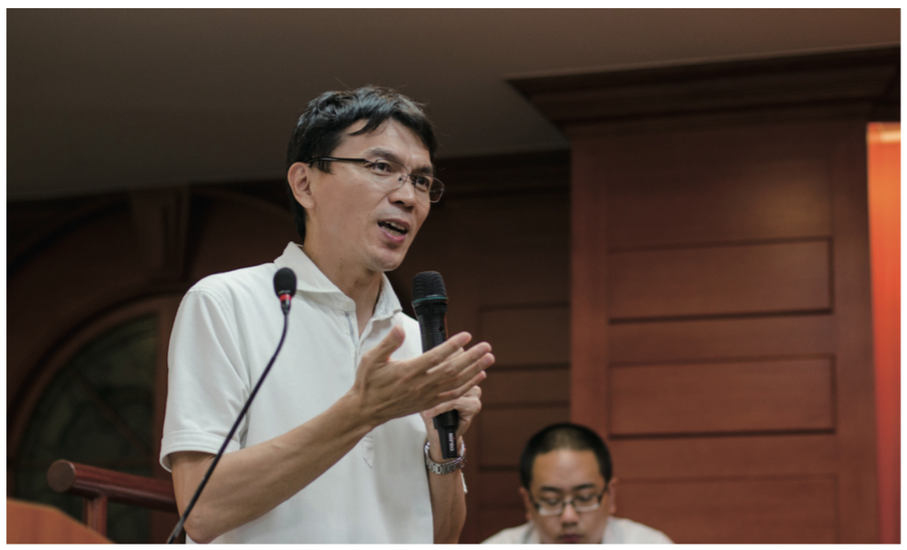
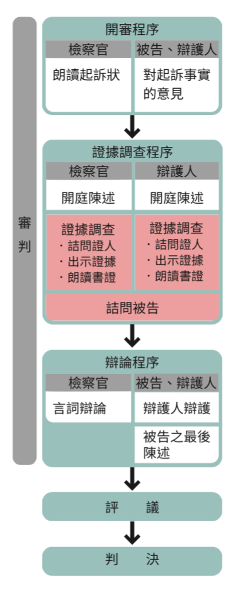
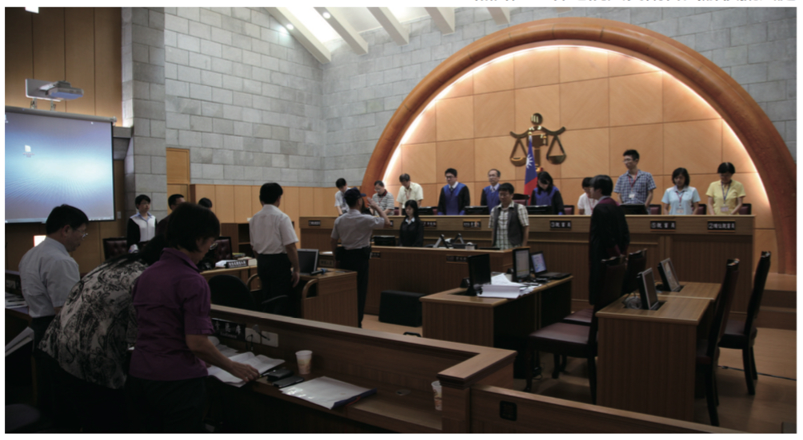
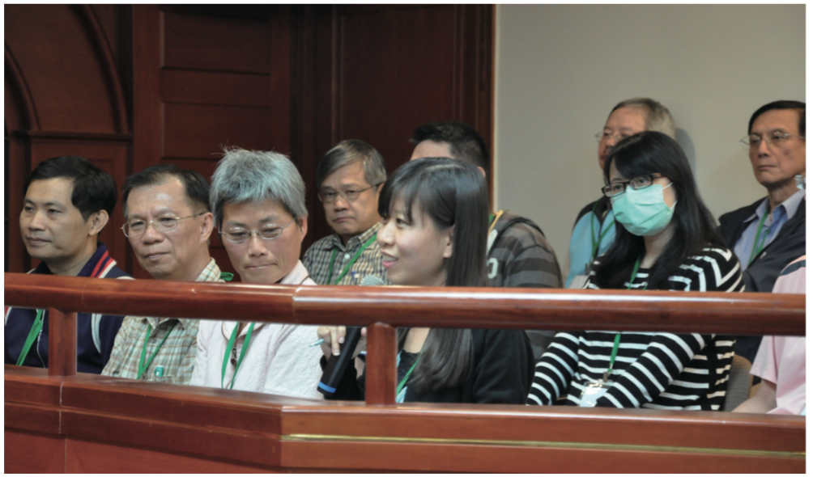

# 評論員 人民參審開啟司改新頁

**林裕順 中央警察大學刑事系教授、司改會常務執行委員**

#### 人民參審 文創基地

日前，美國影星湯姆漢克主演電影「間諜橋」（Bridge of Spies），故事插曲借鏡司法審判的場景設定，強調訴追被告即使是敵國人犯仍應拒絕違法蒐證，訴說刑事審判遵守「正當程序」壯大國家，相關刑罰與人權的辯證說理擲地有聲、令人動容。相對地，華人電影藉由審判法庭敘述類似公平正義絕無僅有，或也顯見司法審判對於華文社群仍屬陌生，審判程序對於本地民眾亦有隔閡。然而，刑事犯罪大多源自貪、嗔、癡、怨之人生百態舉世皆然，審判法庭處理是非對錯、公平正義的人性劇場各國共通。台灣現行刑事審判程序運作過程，或不難取材引發共鳴的個案資料，或聚焦足供審、檢、辯充分揮灑的審判舞台。

例如，我國大法官釋字五八二號解釋，開啟「徐自強案」死刑判決再審程序，避免可能的審理誤判造就司法冤魂。再者，本世紀初台灣司法變革或也追隨美、日刑事思潮，揚棄傳統被告彷彿「待罪之身」傳統陋習，廢除歷來被告僅止「待審之人」規範沉痾，建置「當事人主義」訴訟機制，尊重被告為訴訟主體且屬程序競爭者。其中，審判法庭「交互詰問」原是理性對話、引人入勝的關鍵步驟，證人供述用詞用語、一顰一笑真相勝負之重要場景。然而，台灣審判法庭運作大多關注電腦螢幕筆錄紀載、偏重書狀審理，違反「直接審理」、「言詞審理」刑事審判基本原則，背離「目視耳聞」、「即知其義」人民參審基本前提，殊難想像如同人民參審程序吸納多元意見，彰顯本土民心風情、標誌在地人文關懷。

#### 人民參審 不懂枉然

近年，東亞日本、韓國因應全球化思潮，並為反映當地善惡思維、貼近在地法感心
聲，「人民參審」均為該國司改擘畫的關鍵核心，邀請民眾進入法庭、親身參與審理詮
釋公平、闡釋正義。惟參審、陪審或觀審等等人民參與審判的方式爭議，往往流於政治
語言、意氣之爭。參考各國人民參與審判制度運作，人民是否願意共同承擔維護公平正
義的成敗關鍵，均多繫於能否建置刑事審判速審速決、簡易明瞭親民、便民、利民之訴
訟程序。同時，觀察日、韓人民參審制度得以順利運作，亦都率先進行刑事訴訟制度調
整，落實直接、言詞審理基本原則，法庭審判並以人證調查為主進行交互詰問。蓋人民
參審制度運作下，相較職業法官參與的民眾乃「法律素人」~「無」充分時間、「無」
法律知識、「無」訴訟經驗。

因此，人民參審之刑事審判程序，應該特別考量（1）簡單迅速：降低民眾的可能負擔，審理應連續開庭、兩三天審結。（2）淺顯易懂：便於民眾容易理解，審理聚焦爭點、簡化證據數量。（3）正當程序：確保真相釐清、人權維護，審理仍應遵守「正當程序」憲法規範。換言之，審判期日之訴訟進行「開審程序」、「證據調查」、「論告辯論」、「評議判決」，應該連動呼應、一氣呵成，「起」、「承」、「轉」、「合」節奏分明。

#### 人民參審 起承轉合

##### 起 開審程序，各表立場

法官、檢察官、被告（辯護人）藉由審判初始程序步驟，宣示訴訟過程各自擔綱主持、攻擊、防禦角色，同時分由檢察官、被告（辯）各自宣示對於案件的意見主張。然而，檢辯雙方於此階段僅止於立場宣示，不能偷渡證據資料或浮誇的圖繪、卡通等等，汙染判斷者心証或紊亂審理節奏。

##### 承 證據調查，實事求是

因應人民參審淺顯易懂的制度要求，證據調查程序之初檢辯雙方應作「開審陳述」（0pening statement），用以說明檢辯雙方各自立場主張之證據布局。開審陳述主要提示事實主張與爭點、證據架構，以及舉證要旨說明證據調查與事實主張的關聯。再者，考量審判素人並不習於刑案兇殘景象，有關相片、影片等之證據調查應更為審慎，確保參與民眾理性、嚴謹思維判斷，並降低可能的心理衝擊維其身心健康。亦即，數位影音資料證據調查，應經當事雙方同意、評估，並且舉證要旨應先敘明確有必要。

##### 轉 論告辯論，意見說理

檢辯論告辯論各自闡釋證據調查的看法主張，並須呼應先前開審陳述（0pening statement）之證據布局。提請注意者，證據如何詮釋解讀、涵攝適用等等論證攻防，僅限於經前項證據調查程序者。蓋此項辯論程序過程，若有一方提出先前未提之證據標的，於此階段對造一方並無反證檢驗之機制設計，彷如趁人不意、出手突襲，難謂公平審判亦無助真相釐清。另檢辯實施辯論過程不能援引判決判例，蓋「人各不同」案件事實不會有一模一樣的情境，「世事多變」相關人、事、時、地、物或有不同。

##### 合 評議判決，多元共決

人民參與司法審判的制度意義，並非人民得以坐在法壇高高在上，或徒使人民了解體會法官的辛勞、苦惱等，而是匯集不同的人生經驗、反映多元背景思維，彼此討論、溝通說服、達成共識，共同詮釋個案公平正義。同時，法院判決具體宣示論據、證據理由，直接面對被告人體肉軀，宣告包括死刑、自由行等刑罰，彰顯判決內容並非「紙上談兵」而是「人民共識」。

#### 人民參審 司改三箭

對照台灣解除戒嚴以來，國會改選、總統民選等等政治變革民主進程，相信未來我國司改推動演進，審判過程同樣不能忽略民眾參與、民眾觀點、民眾言語。司法審判「人民頭家」、公平正義「人民參與」，乃成熟民主國家、健全法治社會，以及獨立自主人民的「最後一哩路」。同時，避免審判程序「起、承、轉、合」流於形式，並能建置「目視耳聞」、「即知其義」審判制度，落實「由下而上」多元詮釋公平正義，台灣理應迎頭趕上「人民參審」時代趨勢。參考日本、韓國採行「人民參審」司改變革，我國現行刑事審判制度仍需配套增修，包括：

1. 公平競爭~廢止「卷證併送制度」

  歷來我國大法官解釋強調「直接審理」「言詞辯論」原則遵守，要求法官必須親自接觸原始人證、物證等第一手資料，維護當事人反對詰問或驗證可能，以確保案件審理實事求是、釐清真相。因此，廢除起訴時偵查「卷證併送」制度（刑訴第 264 條第 3 項），採行「起訴狀一本主義」避免檢審不分、杜絕卷證偷渡，維護判斷者中立公平立場。同時，配套採行「訴因制度」，明確爭點「告什麼」、「審什麼」，刪除「起訴不可分」（刑訴第 267 條）避免法官突襲審判。

2. 光明正大~創設「證據開示制度」

  刑事審判「當事人主義」訴訟機制下，為確保迅速、充實之審理程序，當事人於審判期日前事先準備、整理爭點，擬訂明確審理計畫。然被告雖謂與檢察官立於對等立場之當事人，實際上自行蒐集證據能力較弱，若能直接檢閱檢察官蒐集之證據資料，不僅促進爭點整理、刑事裁判之迅速，亦有助被告防禦權利及公平競爭真相釐清。並且，類如上述「卷證併送」制度下，為能從「全案卷宗」龐雜證據資料，得以集中爭點、嚴選證據提升審理效率，「證據開示制度」建置、運用亦應多所關注。

3. 自我負責~改變「證據調查方法」

  「證據調查」乃判斷者於審判期日為能取得心證，進行包括物證（刑訴法 164）、書證（刑訴法 165）及人證（刑訴法 166 以下）各種調查程序。因此，為能確保無罪推定原則、落實檢察官訴追犯罪的舉證責任，前項證據調查方法之出證方式不宜由法官主導，而應改由檢辯雙方自行實施「自我負責」，法官僅止於補充、輔助調查立場不該「暄賓奪主」。

臺灣「人民參審」司法改革若要成功，審、檢、辯、學同一陣線攜手合作不可欠缺，並且共同說服社會大眾樂意承擔誠屬關鍵。人民參與司法審判的底蘊，無非以人的立場方式判斷思維，展現世間人情世故的美麗景緻。民間司法改革基金會成立二十年，關心本土、守護人權、扶助弱勢，願以本文獻上個人誠摯祝福。

